# Dcard Backend Intern Homework 2024

<!--ts-->
- [Dcard Backend Intern Homework 2024](#dcard-backend-intern-homework-2024)
  - [Result](#result)
  - [Overview](#overview)
    - [Components](#components)
      - [Business State Machine (Service State, Reply Cache)](#business-state-machine-service-state-reply-cache)
      - [Replicated Logs (Ordering, Log Management)](#replicated-logs-ordering-log-management)
      - [Snapshot \& Recovery (Catch-up, Failure Detection)](#snapshot--recovery-catch-up-failure-detection)
      - [Remove Outdated Data from memory](#remove-outdated-data-from-memory)
  - [Implement Practice](#implement-practice)
    - [Persistence Layer - PostgreSQL](#persistence-layer---postgresql)
    - [Log Layer - Redis Stream](#log-layer---redis-stream)
    - [In-Memory Database (Local State Machine)](#in-memory-database-local-state-machine)
      - [Benchmark](#benchmark)
    - [Fault Recovery](#fault-recovery)
    - [Sanitize the Stale Data](#sanitize-the-stale-data)
  - [Testing](#testing)
    - [Unit Test](#unit-test)
    - [K6 Load Test](#k6-load-test)
  - [Misc](#misc)
    - [Test Coverage](#test-coverage)
    - [Swagger API Document](#swagger-api-document)
    - [Code Statistic](#code-statistic)

<!-- Created by https://github.com/ekalinin/github-markdown-toc -->
<!-- Added by: lixucheng, at: Fri Mar 15 23:54:11 CST 2024 -->

<!--te-->

## Result

1. QPS: 96000/s [K6 Load Test](#k6-load-test)
   - the bottleneck is at the `gin` router, If the router engine has unlimited QPS, the QPS would be up to 800000/s - [gin performance](https://github.com/gin-gonic/gin?tab=readme-ov-file#benchmarks)

## Overview

When I saw the requirements for this topic, I was wondering if a QPS (Queries Per Second) > 10,000 could be solved simply using a single Redis instance. So, I started thinking about this problem and came up with a more interesting solution. This solution involves using an in-memory database to address the issue, along with a Redis stream for handling log ordering, and PostgreSQL for persistence. As it's a local in-memory database, the read operations can be infinitely scaled using solutions like Kubernetes Deployment or `docker compose --scale`. However, write operations are still limited by the speed of `max(redis, postgres)`. In my implementation, I've made every effort to ensure the system is fault-tolerant and consistent. If anyone notices any cases I haven't considered or areas that could be optimized, please feel free to point them out. Thank you!

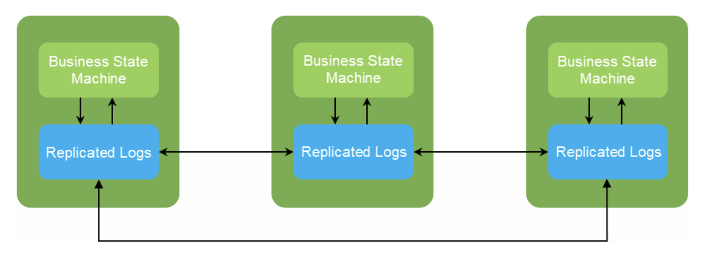

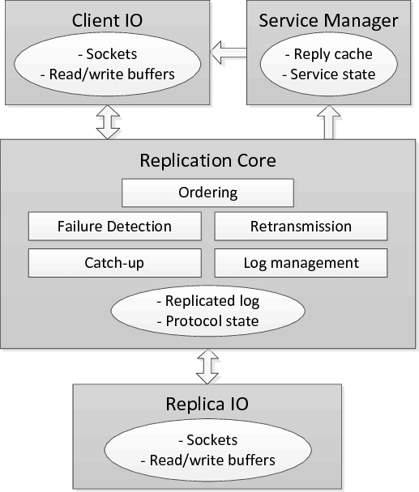

The main components in my system design idea have five parts, which can correspond to the `Servers` in the above figure respectively.

### Components

#### Business State Machine (Service State, Reply Cache)

For each instance, it is a state machine that can handle the advertisement CRUD operation and the range query operation. In the above diagram, it should use single-threaded to guarantee the read and write order. In Our Scenario, the consistency isn't the most important thing, so we can use `Readers–writer lock` to handle the concurrent read, the write operation is still single-threaded.

#### Replicated Logs (Ordering, Log Management)

It is hard to implement a Linearizable Log System. so I can use `Redis Stream` to handle the log ordering and the log replication.

> Use redis lock to prevent the concurrent write to postgres and redis stream

#### Snapshot & Recovery (Catch-up, Failure Detection)

The state machine can be recovered from the snapshot, and the snapshot only modified if there is a new create, update, or delete operation. The snapshot can be stored in postgresql, and the recovery process can be done by the snapshot and the log to prevent the state machine need to replay all the log from the beginning. The concept is similar to the `AOF` and `RDB` in redis.

#### Remove Outdated Data from memory

Since we didnt use the interval tree to handle the range query, we need to remove the outdated data from the in-memory database, so we need to use some `scheduler` to remove the outdated data from the in-memory database.

I choose the [`asynq`](https://github.com/hibiken/asynq) to act as the scheduler

> after multiple worker race for handling the delete task, the delete log would be also published to the redis stream, so the state machine can also handle the delete operation, this method also prevent the `Restore` operation from reading and serving stale data.

## Implement Practice

### Persistence Layer - PostgreSQL

- each advertisement is stored in the `ad` table, the multi-choice field is stored as string array(postgresql array type)

```go
type Ad struct {
 ID       uuid.UUID      `gorm:"type:uuid;primary_key" json:"id"`
 Title    string         `gorm:"type:text" json:"title"`
 Content  string         `gorm:"type:text" json:"content"`
 StartAt  CustomTime     `gorm:"type:timestamp" json:"start_at" swaggertype:"string" format:"date" example:"2006-01-02 15:04:05"`
 EndAt    CustomTime     `gorm:"type:timestamp" json:"end_at" swaggertype:"string" format:"date" example:"2006-01-02 15:04:05"`
 AgeStart uint8          `gorm:"type:integer" json:"age_start"`
 AgeEnd   uint8          `gorm:"type:integer" json:"age_end"`
 Gender   pq.StringArray `gorm:"type:text[]" json:"gender"`
 Country  pq.StringArray `gorm:"type:text[]" json:"country"`
 Platform pq.StringArray `gorm:"type:text[]" json:"platform"`
 Version   int           `gorm:"index" json:"version"`
 IsActive  bool          `gorm:"type:boolean; default:true" json:"-" default:"true"`
 CreatedAt CustomTime    `gorm:"type:timestamp" json:"created_at"`
}
```

### Log Layer - Redis Stream

> no leader, no follower, all instance(replica) are equal

- use `XADD` to append the log (create, update, delete)
  - the publisher replica did not update its inmemory database at the same time
- all instance subscribe with `XREAD` to get the log
- the inmemory database for each replica only update if the replica receive the log from the redis stream

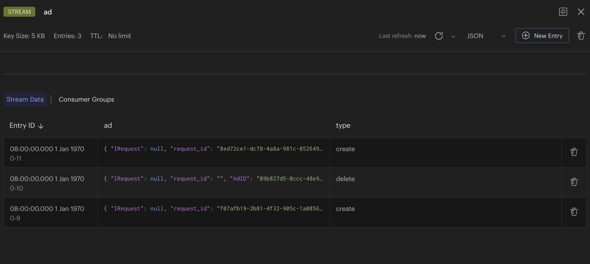

> the request id is for recognizing which client should return the response to.

### In-Memory Database (Local State Machine)

- multi-read/single-write lock
- implement the advertisement store by map with id primary key
- implement the advertisement indexing by map[string]mapset.Set[string]
  - By the way, originally I was using `map[string]map[string]*model.Ad`, and the concurrent read speed was only 4000 QPS. After changing it to `map[string]mapset.Set[string]`, the concurrent read speed increased to over 10000 QPS!!!
  - upd: I leverage the characteristic of `Pointer is Comparable` in Golang, then the performance become: write: 407676.68 QPS / read: 22486.06 QPS
  - I'm considering implementing multi-indexing to improve the read performance, not yet implemented currently
  - upd: I have tried to implement the multi-indexing, the write performance is down, but the read performance is now 1166960 QPS, so I think it's worth it - [commit detail](https://github.com/peterxcli/dcard-backend-2024/commit/028f68a2b1e770aac0754331826fd3110aa0b977)
  - define the multi-indexing with priority, and use reflect to generate the index function(tree structure), and use concurrent map to store the index, we would add the index concurrently, the result read performance become 800000 QPS
- ~~implement the advertisement range query(ageStart, ageEnd, StartTime, EndTime) by interval tree~~
  - I have tried some interval tree library, but the read performance is not good, so I give up this implementation
  - Currently, I just iterate all the advertisement and filter the result by the condition

#### Benchmark

> if interval tree is in use, it doesn't apply on time range query since the performance issue

1. github.com/rdleal/intervalst
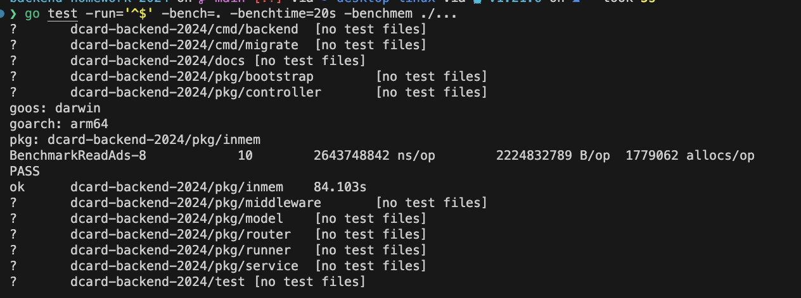
2. github.com/biogo/store/interval
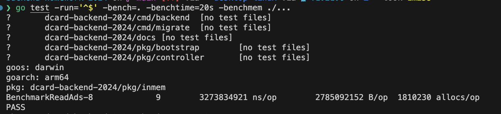
3. Just iterate all the advertisement and filter the result by the condition
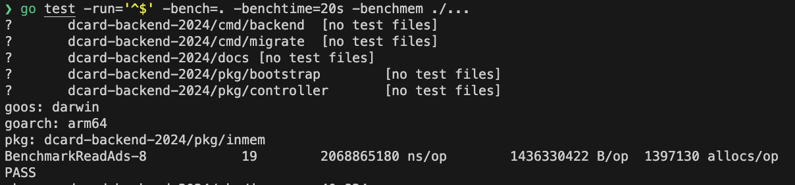
4. compound index with nested map - 1000000 QPS
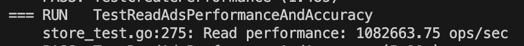
1. compound index generalization (provide the easy-to-use index API function and the index priority, tree structure) - 800000 QPS
  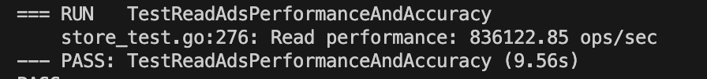
  provide a flexible API for the developer to define the index, but the performance reduce about 10%, move some coding complexity to time & space complexity

### Fault Recovery

- The recovery process is done by the snapshot and the log to prevent the state machine need to replay all the log from the beginning
- the snapshot only modified if there is a new create, update, or delete operation
- the snapshot can be stored in postgresql
- retry if the snapshot version and the log version is not match
- if there aren't any problem, start to subscribe the log from the snapshot version and replay the log

### Sanitize the Stale Data

- Use `asynq` to act as the scheduler

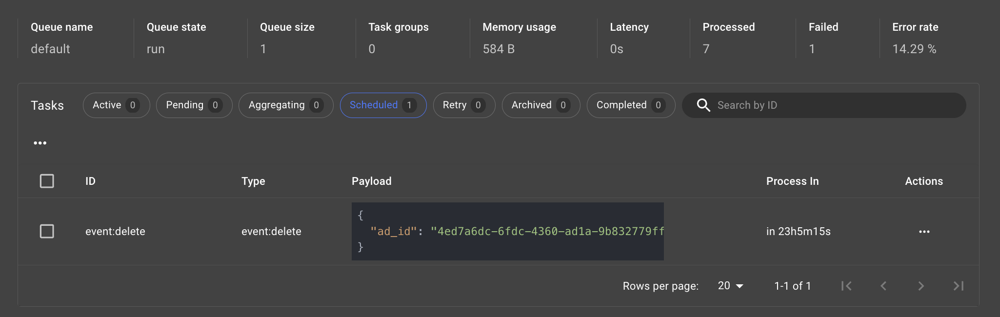

- after the time display in the `process in` column, the advertisement deleted operation would consider as a log which is persisted in the redis stream, so the state machine can also handle the delete operation, this method also prevent the `Restore` operation from reading and serving stale data.

## Testing

### Unit Test

- gotests auto generate test functions
- [redis mock](https://github.com/go-redis/redismock/v9)
- [sqlmock](https://github.com/DATA-DOG/go-sqlmock)

### K6 Load Test

```bash
make install-k6
cp .env.example env.dev
make dev-up
make dev-migrate
make run-release # run the server
make k6 # run on another terminal
```

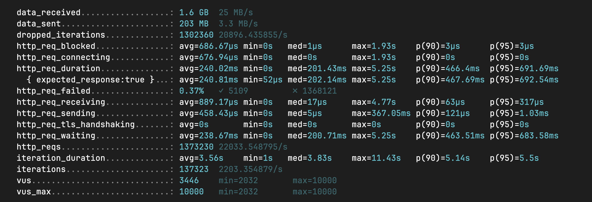

## Misc

### Test Coverage

<https://dcard-backend-intern-2024.peterxcli.dev/coverage>

### Swagger API Document

<https://dcard-backend-intern-2024.peterxcli.dev/docs>

### Code Statistic

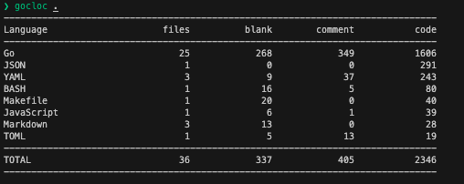
