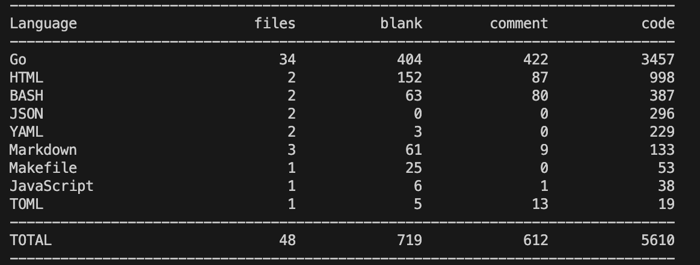

# Dcard Backend Intern Homework 2024

## Overview

看到這個題目要求的時候, 就在想說這個 QPS > 10000 是單純可以用一個 redis 就可以解決的問題嗎?, 所以我就開始思考這個問題, 並且想到了一個比較有趣的解法, 這個解法是用一個 in-memory database 來處理這個問題, 並且用一個 redis stream 來處理 log ordering, 並且用 postgresql 來處理持久化的部分, 因為是 local 的 in-memory database, 所以只要透過像是 K8s Deployment 或是 `docker compose --scale` 就可以無限擴展讀取的操作的速度, 不過寫入的話就還是受限於 `max(redis, postgres)` 的速度, 我在實作裡已經盡力讓系統是 fault tolerance & consistency 的, 如果有人注意到我有哪些 case 沒有考慮到或是處理得不好可以優化的地方, 再麻煩各位提出來, 謝謝!

The main components in my system design idea have three parts, which can correspond to the `Servers` in the above figure respectively.

### Components

#### State Machine

For each instance, it is a state machine that can handle the advertisement CRUD operation and the range query operation. In the above diagram, it should use single-threaded to guarantee the read and write order. In Our Scenario, the consistency isn't the most important thing, so we can use `Readers–writer lock` to handle the concurrent read, the write operation is still single-threaded.

#### Consensus & Log Ordering

It is hard to implement a Linearizable Log System. so I can use `Redis Stream` to handle the log ordering and the log replication.

> Use redis lock to prevent the concurrent write to postgres and redis stream

#### Snapshot & Recovery

The state machine can be recovered from the snapshot, and the snapshot only modified if there is a new create, update, or delete operation. The snapshot can be stored in postgresql, and the recovery process can be done by the snapshot and the log to prevent the state machine need to replay all the log from the beginning. The concept is similar to the `AOF` and `RDB` in redis.

## Implement Practice

### Persistence Layer - PostgreSQL

### Log Layer - Redis Stream

### In-Memory Database (Local)

- multi-read/single-write lock
- implement the advertisement store by map with id primary key
- implement the advertisement indexing by map[string]mapset.Set[string]
  - By the way, originally I was using `map[string]map[string]*model.Ad`, and the concurrent read speed was only 4000 QPS. After changing it to `map[string]mapset.Set[string]`, the concurrent read speed increased to over 10000 QPS!!!
- ~~implement the advertisement range query(ageStart, ageEnd, StartTime, EndTime) by interval tree~~
  - I have tried some interval tree library, but the read performance is not good, so I give up this implementation
  - Currently, I just iterate all the advertisement and filter the result by the condition

#### Benchmark

> if interval tree is in use, it doesnt apply on time range query since the performance issue

1. github.com/rdleal/intervalst

2. github.com/biogo/store/interval

3. Just iterate all the advertisement and filter the result by the condition

### Recovery

## Misc

## 後話

1. 可以用 postgres CDC 來同步變動到 queue 裡面來達到更好的資料一致性, 但這只是一個 POC, 所以暫時沒有實作
