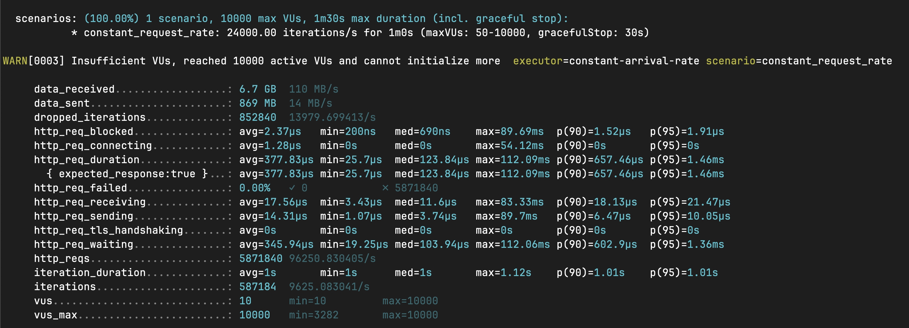

# Dcard Backend Intern Homework 2024

<!--ts-->
- [Dcard Backend Intern Homework 2024](#dcard-backend-intern-homework-2024)
  - [Benchmark Result](#benchmark-result)
  - [Short Description](#short-description)
  - [Overview](#overview)
    - [Replicated Business State Machine](#replicated-business-state-machine)
    - [A good diagram that maps the components in my system design idea](#a-good-diagram-that-maps-the-components-in-my-system-design-idea)
    - [Components](#components)
      - [Business State Machine (Service State, Reply Cache)](#business-state-machine-service-state-reply-cache)
      - [Replicated Logs (Ordering, Log Management)](#replicated-logs-ordering-log-management)
      - [Snapshot \& Recovery (Catch-up, Failure Detection)](#snapshot--recovery-catch-up-failure-detection)
      - [Remove Outdated Data from memory](#remove-outdated-data-from-memory)
  - [Implementation Practice](#implementation-practice)
    - [Persistence Layer - PostgreSQL](#persistence-layer---postgresql)
    - [Log Layer - Redis Stream](#log-layer---redis-stream)
      - [Availability](#availability)
    - [In-Memory Database (Local State Machine)](#in-memory-database-local-state-machine)
      - [Current Implementation](#current-implementation)
        - [Custom LeftMost Prefix Index Rule](#custom-leftmost-prefix-index-rule)
        - [Concurrent Tree Structure Index](#concurrent-tree-structure-index)
          - [IndexInternalNode](#indexinternalnode)
          - [IndexLeafNode](#indexleafnode)
        - [Tree Structure Interface and Struct](#tree-structure-interface-and-struct)
      - [Implementation Progress](#implementation-progress)
      - [Benchmark](#benchmark)
    - [Fault Recovery](#fault-recovery)
    - [Sanitize the Stale Data](#sanitize-the-stale-data)
  - [Testing](#testing)
    - [Unit Test](#unit-test)
    - [K6 Load Test](#k6-load-test)
      - [K6 Load Test Result](#k6-load-test-result)
  - [Misc](#misc)
    - [Test Coverage](#test-coverage)
    - [Swagger API Document](#swagger-api-document)
    - [Code Statistic](#code-statistic)

<!-- Created by https://github.com/ekalinin/github-markdown-toc -->
<!-- Added by: lixucheng, at: Fri Mar 15 23:54:11 CST 2024 -->

<!--te-->

## Benchmark Result

- Local: QPS: `96000/s`
  - [K6 Load Test](#k6-load-test)
  - The bottleneck is at the `gin` router, If the router engine has unlimited QPS, the QPS would be up to 800000/s - [gin performance](https://github.com/gin-gonic/gin?tab=readme-ov-file#benchmarks)

## Short Description

A **infinite scalable** advertisement management system, baked with replicated advertisement business state machine, replicated log system, and fault recovery mechanism. Guaranteed the consistency and durability of the advertisement operation.

## Overview

When I saw the requirements for this topic, I was wondering if a QPS (Queries Per Second) > 10,000 could be solved simply using a single Redis instance. So, I started thinking about this problem and came up with a more interesting solution. This solution involves using an in-memory database to address the issue, along with a Redis stream for handling log ordering, and PostgreSQL for persistence. As it's a local in-memory database, the read operations can be infinitely scaled using solutions like Kubernetes Deployment or [`docker compose --scale`](https://docs.docker.com/reference/cli/docker/compose/up/#options). However, write operations are still limited by the speed of `max(redis, postgres)`, however, we can choose NOSQL database to achieve the higher write speed, and use Kafka to handle the log ordering and log replication as redis stream alternative[(better consistency and durability)](https://www.instaclustr.com/blog/redis-streams-vs-apache-kafka/). In my implementation, I've made every effort to ensure the system is fault-tolerant and consistent. If anyone notices any cases I haven't considered or areas that could be optimized, please feel free to point them out. Thank you!

### Replicated Business State Machine


### A good diagram that maps the components in my system design idea


The main components in my system design idea have five parts, which can correspond to the `Servers` in the above figure respectively.

### Components

#### Business State Machine (Service State, Reply Cache)

For each instance, it is a state machine that can handle the advertisement CRUD operation and the range query operation. In the above diagram, it should use single-threaded to guarantee the read and write order. In Our Scenario, the consistency isn't the most important thing, so we can use `Readers–writer lock` to handle the concurrent read, the write operation is still single-threaded.

#### Replicated Logs (Ordering, Log Management)

It is hard to implement a Linearizable Log System. so I can use `Redis Stream` to handle the log ordering and the log replication.

> Use redis lock to prevent the concurrent write to postgres and redis stream

#### Snapshot & Recovery (Catch-up, Failure Detection)

The state machine can be recovered from the snapshot, and the snapshot only modified if there is a new create, update, or delete operation. The snapshot can be stored in postgresql, and the recovery process can be done by the snapshot and the log to prevent the state machine need to replay all the log from the beginning. The concept is similar to the `AOF` and `RDB` in redis.

#### Remove Outdated Data from memory

Since we didn't use the interval tree to handle the range query, we need to remove the outdated data from the in-memory database, so we need to use some `scheduler` to remove the outdated data from the in-memory database.

I choose the [`asynq`](https://github.com/hibiken/asynq) to act as the scheduler

> after multiple worker race for handling the delete task, the delete log would be also published to the redis stream, so the state machine can also handle the delete operation, this method also prevent the `Restore` operation from reading and serving stale data.

## Implementation Practice

### Persistence Layer - PostgreSQL

- each advertisement is stored in the `ad` table, the multi-choice field is stored as string array(postgresql array type)

```go
type Ad struct {
 ID       uuid.UUID      `gorm:"type:uuid;primary_key" json:"id"`
 Title    string         `gorm:"type:text" json:"title"`
 Content  string         `gorm:"type:text" json:"content"`
 StartAt  CustomTime     `gorm:"type:timestamp" json:"start_at" swaggertype:"string" format:"date" example:"2006-01-02 15:04:05"`
 EndAt    CustomTime     `gorm:"type:timestamp" json:"end_at" swaggertype:"string" format:"date" example:"2006-01-02 15:04:05"`
 AgeStart uint8          `gorm:"type:integer" json:"age_start"`
 AgeEnd   uint8          `gorm:"type:integer" json:"age_end"`
 Gender   pq.StringArray `gorm:"type:text[]" json:"gender"`
 Country  pq.StringArray `gorm:"type:text[]" json:"country"`
 Platform pq.StringArray `gorm:"type:text[]" json:"platform"`
 Version   int           `gorm:"index" json:"version"`
 IsActive  bool          `gorm:"type:boolean; default:true" json:"-" default:"true"`
 CreatedAt CustomTime    `gorm:"type:timestamp" json:"created_at"`
}
```

### Log Layer - Redis Stream

> No leader, no follower, all instance(replica) are equal

- Use `XADD` to append the log (create, update, delete)
  - The publisher replica did not update its inmemory database at the same time
- All instance subscribe with `XREAD` to get the log
- The in-memory database for each replica only update if the replica receive the log from the redis stream


> the request id is for recognizing which client should return the response to.

#### Availability

We can use the redis `sentinel` mode to handle the redis high availability

### In-Memory Database (Local State Machine)

> After trying so many ways, I think the most robust, simple, and efficient way is to use `sqlite` as [in-memory database](https://www.sqlite.org/inmemorydb.html). The performance is also good, [the SQL read speed would be about 60000/s](https://turriate.com/articles/making-sqlite-faster-in-go), However, the real query may be slower than ideal speed since the query is not simple as the benchmark query. But remember, our design can scale the read operation speed linearly to infinite, so the read speed in a single instance is not the most important thing.

#### Current Implementation

##### Custom LeftMost Prefix Index Rule

Implement a func call `GetNextIndexKey` to determine the composited index order, the index with greater selectivity should be the leftmost index.

```go
func (a Ad) GetNextIndexKey(currentKey string) string {
    switch currentKey {
    case "":
        return "Age"
    case "Age":
        return "Country"
    case "Country":
        return "Platform"
    case "Platform":
        return "Gender"
    default:
        return ""
    }
}
```

##### Concurrent Tree Structure Index


###### IndexInternalNode

1. AddAd
   - If the key is not in the children, create a new leaf node and add the ad to the leaf node
   - If the key is in the children, call the AddAd recursively
   - If the key is the last key, add the ad to the leaf node
2. GetAd
    - If the key is not in the children, return an empty array
    - If the key is in the children, call the GetAd recursively
    - If the key is the last key, return the ads in the leaf node
3. Concurrent Read/Write
    - Use ConcurrentMap to store the children, If there is a bulk write operation, we can use multiple goroutines to write the children concurrently

###### IndexLeafNode

1. AddAd
   - Add the ad to the sorted set
2. GetAd
    - Use the GetByRankRange to support the offset and limit query
3. Concurrent Read/Write
    - Use the `sync.RWMutex` to protect the read and write operation

##### Tree Structure Interface and Struct

```go
type IndexNode interface {
    AddAd(ad *model.Ad)
    GetAd(req *model.GetAdRequest) ([]*model.Ad, error)
    DeleteAd(ad *model.Ad)
}

type IndexInternalNode struct {
    Key      string // The key this node indexes on, e.g., "country", "age"
    Children cmap.ConcurrentMap[FieldStringer, IndexNode] // The children of this node
}

func NewIndexInternalNode(key string) IndexNode {
    return &IndexInternalNode{
        Key:      key,
        Children: cmap.NewStringer[FieldStringer, IndexNode](),
    }
}

type IndexLeafNode struct {
    mu  sync.RWMutex
    Ads *sortedset.SortedSet // map[string]*model.Ad
}

func NewIndexLeafNode() IndexNode {
    return &IndexLeafNode{
        Ads: sortedset.New(),
    }
}
```

#### Implementation Progress

1. Multi-read/single-write lock (v1.0 deprecated)
2. Implement the advertisement store by map with id primary key (v2.0 deprecated)
3. Implement the advertisement indexing by map[string]mapset.Set[string]
   - By the way, originally I was using `map[string]map[string]*model.Ad`, and the concurrent read speed was only 4000 QPS. After changing it to `map[string]mapset.Set[string]`, the concurrent read speed increased to over 10000 QPS!!!
   - upd: I leverage the characteristic of `Pointer is Comparable` in Golang, then the performance become: write: 407676.68 QPS / read: 22486.06 QPS
   - I'm considering implementing multi-indexing to improve the read performance, not yet implemented currently
   - upd: I have tried to implement the multi-indexing, the write performance is down, but the read performance is now 1166960 QPS, so I think it's worth it - [commit detail](https://github.com/peterxcli/ad-server/commit/028f68a2b1e770aac0754331826fd3110aa0b977)
   - define the multi-indexing with priority, and use reflect to generate the index function(tree structure), and use concurrent map to store the index, we would add the index concurrently, the result read performance become 800000 QPS
4. Implement the advertisement range query(ageStart, ageEnd, StartTime, EndTime) by interval tree (v4.0 deprecated)
   - I have tried some interval tree library, but the read performance is not good, so I give up this implementation
   - Currently, I just iterate all the advertisement and filter the result by the condition

#### Benchmark

> if interval tree is in use, it doesn't apply on time range query since the performance issue

1. github.com/rdleal/intervalst

2. github.com/biogo/store/interval

3. Just iterate all the advertisement and filter the result by the condition

4. compound index with nested map - 1000000 QPS

1. compound index generalization (provide the easy-to-use index API function and the index priority, tree structure) - 800000 QPS
  
  provide a flexible API for the developer to define the index, but the performance reduce about 10%, move some coding complexity to time & space complexity

### Fault Recovery

- The recovery process is done by the snapshot and the log to prevent the state machine need to replay all the log from the beginning
- the snapshot only modified if there is a new create, update, or delete operation
- the snapshot can be stored in postgresql
- retry if the snapshot version and the log version is not match
- if there aren't any problem, start to subscribe the log from the snapshot version and replay the log

### Sanitize the Stale Data

- Use `asynq` to act as the scheduler


- after the time display in the `process in` column, the advertisement deleted operation would consider as a log which is persisted in the redis stream, so the state machine can also handle the delete operation, this method also prevent the `Restore` operation from reading and serving stale data.

## Testing

### Unit Test

- gotests auto generate test functions
- [redis mock](https://github.com/go-redis/redismock/v9)
- [sqlmock](https://github.com/DATA-DOG/go-sqlmock)

### K6 Load Test

> Currently, the load test is only performed on the local machine, for a more accurate result, the load test should be performed distributedly, We can adopt the [`k6 operator`](https://grafana.com/docs/k6/latest/testing-guides/running-distributed-tests/) to run the distributed load test in the kubernetes cluster, and the result should be analyzed by the `Prometheus` and `Grafana`

1. Inject random data to the database
2. Run the server, the server would read the data from the database as snapshot and store it in the in-memory database
3. Start the k6 load test

```bash
make install-k6
cp .env.example env.dev
make dev-up
make dev-migrate
make inject # inject the test data
make run-release # run the server
make k6 # run on another terminal
```

#### K6 Load Test Result



## Misc

### Test Coverage

<https://dcard-backend-intern-2024.peterxcli.dev/coverage>

### Swagger API Document

<https://dcard-backend-intern-2024.peterxcli.dev/docs>

### Code Statistic


